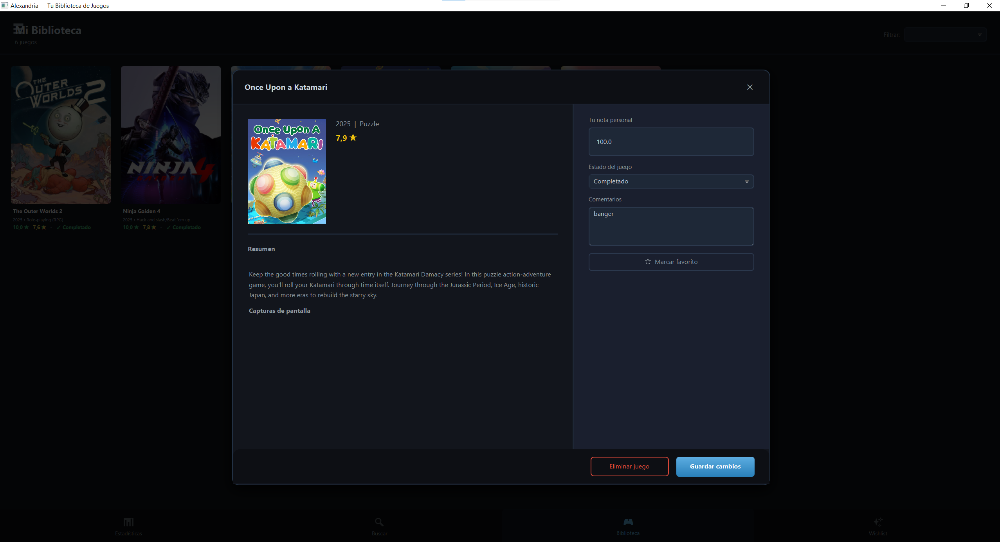
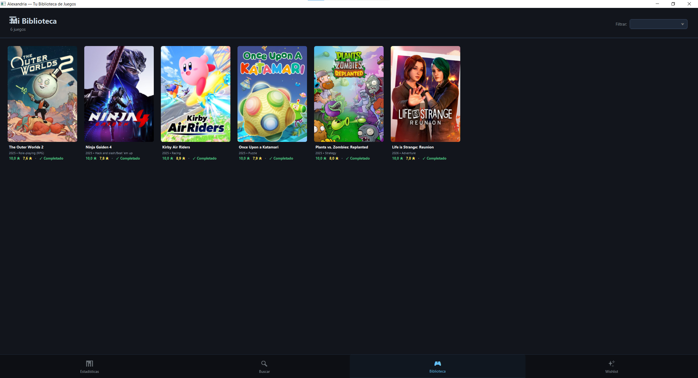
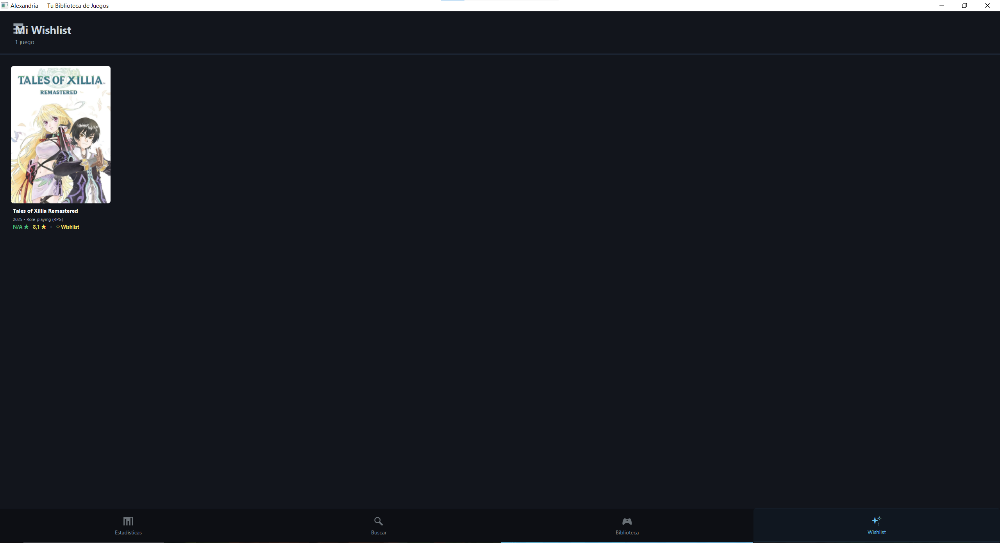
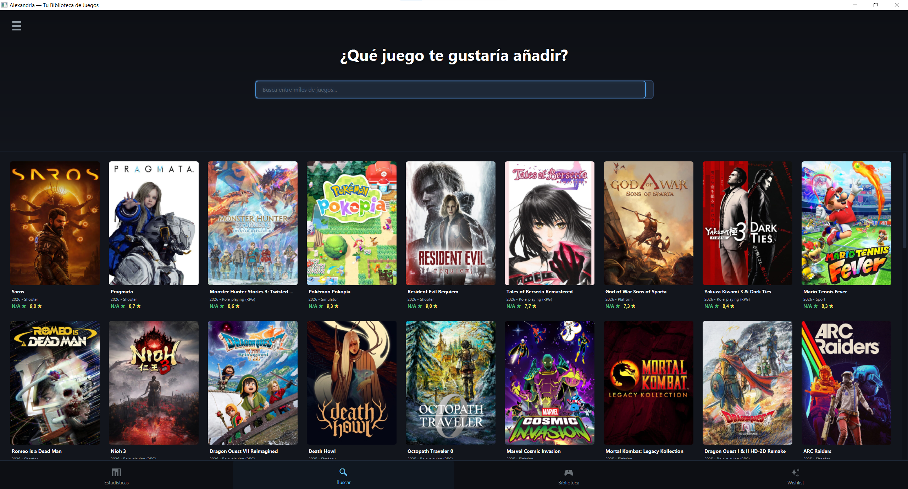
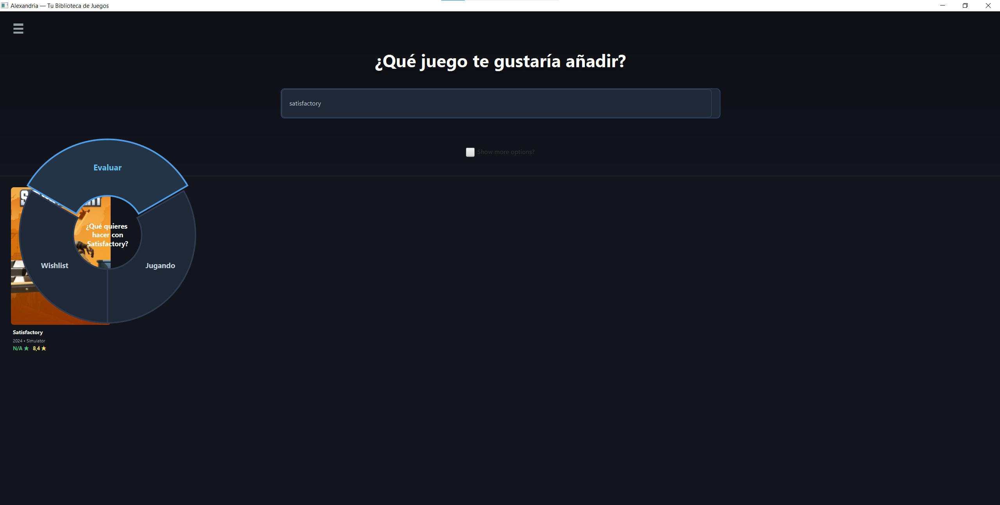
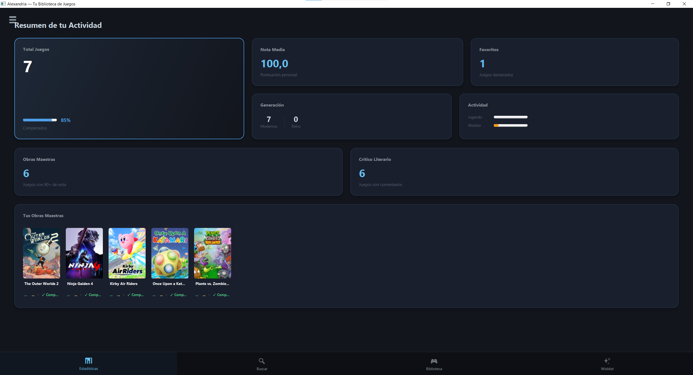

<h1 align="center">Biblioteca Digital de Videojuegos</h1>

Aplicación de escritorio desarrollada en <strong>JavaFX</strong> para gestionar tu historial de videojuegos,
permitiéndote organizar, valorar y comentar todos los juegos que has jugado.

<h2>📌 Descripción del proyecto</h2>

Este proyecto fue desarrollado con el objetivo de crear una aplicación completa para llevar un seguimiento
personal de videojuegos jugados, pendientes y deseados.

Permite mantener un registro detallado de cada juego, incluyendo valoraciones, comentarios personales,
estado de progreso y estadísticas globales como jugador.

Se han implementado funcionalidades avanzadas de filtrado, búsqueda y análisis de datos, junto con mejoras
en diseño y experiencia de usuario utilizando <strong>JavaFX</strong>.

---

<h2>🛠️ Características principales</h2>

<ul>
  <li>Arquitectura basada en <strong>MVC (Modelo, vista, controlador)</strong></li>
  <li>Gestión completa de biblioteca de videojuegos</li>
  <li>Sistema de valoraciones y comentarios por juego</li>
  <li>Estados de juego: completado o jugando</li>
  <li>Wishlist de juegos deseados</li>
  <li>Búsqueda avanzada por nombre, así como filtrado por estado</li>
  <li>Estadísticas personales (horas jugadas, juegos completados, media de notas)</li>
  <li>Interfaz moderna con elementos visuales dinámicos</li>
</ul>

---

<h2>🎮 Funcionalidades principales</h2>

<h3>Biblioteca</h3>
<ul>
  <li>Visualización de todos los juegos registrados</li>
  <li>Edición y eliminación de juegos</li>
  <li>Filtros por estado</li>
</ul>

<h3>Wishlist</h3>
<ul>
  <li>Lista de juegos que deseas jugar en el futuro</li>
  <li>Conversión rápida a juego jugado</li>
</ul>

<h3>Búsqueda</h3>
<ul>
  <li>Búsqueda de juegos por nombre</li>
  <li>Visualización de resultados en tiempo real</li>
</ul>

<h3>Estadísticas</h3>
<ul>
  <li>Total de juegos jugados</li>
  <li>Horas acumuladas</li>
  <li>Media de valoraciones</li>
  <li>Distribución por estados</li>
</ul>

---

<h2>🖥️ Capturas de la aplicación</h2>

<h3>Menú principal</h3>

<h3>Biblioteca de juegos</h3>

<h3>Wishlist</h3>

<h3>Búsqueda de juegos</h3>

<h3>Resultado de búsqueda</h3>

<h3>Estadísticas</h3>

---

<h2>📊 Ejemplo de datos gestionados</h2>

<table>
  <tr>
    <th>Juego</th>
    <th>Estado</th>
    <th>Nota</th>
    <th>Comentario</th>
  </tr>
  <tr>
    <td>The Witcher 3</td>
    <td>Completado</td>
    <td>10</td>
    <td>Muy bueno!</td>
  </tr>
  <tr>
    <td>Elden Ring</td>
    <td>En progreso</td>
    <td>9</td>
    <td>-</td>
  </tr>
  <tr>
    <td>Hollow Knight</td>
    <td>Completado</td>
    <td>9</td>
    <td>Bastante decente</td>
  </tr>
  <tr>
    <td>Cyberpunk 2077</td>
    <td>Pendiente</td>
    <td>-</td>
    <td>0</td>
  </tr>
</table>

---

<h2>🚀 Tecnologías utilizadas</h2>

<ul>
  <li>Java</li>
  <li>JavaFX</li>
  <li>Firebase</li>
  <li>Maven</li>
</ul>

---

<h2>📌 Notas adicionales</h2>

Este proyecto está enfocado tanto en la organización personal como en el análisis de hábitos de juego,
sirviendo como una herramienta útil para cualquier aficionado a los videojuegos.

Además, está diseñado siguiendo buenas prácticas de desarrollo para facilitar su mantenimiento y escalabilidad.

